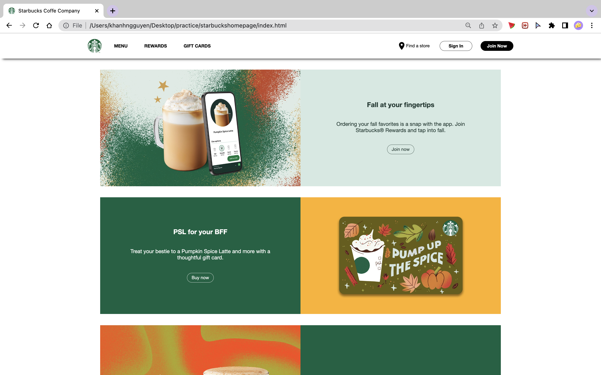
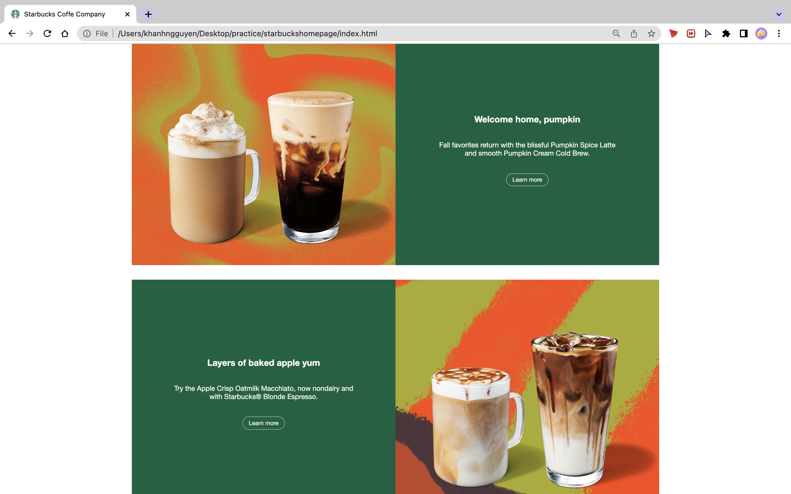
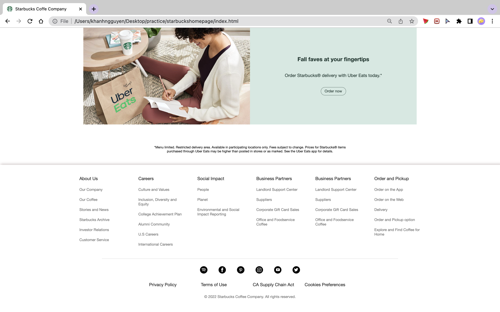

# Starbucks hompage

## Project objectives
Practice basics of HTML & CSS by recreating Starbucks homepage

## Outcomes

*Screenshots of pages at zoom level 67%*

## Learning outcomes
- Download and get started with VS Code
- Create a static webpage using HTML & CSS
- Use basics of HTML
- Get familiar with basics of CSS, e.g. import & use fonts, use flexbox for layout, sizing images inside ``tag

## Known limitations
- Divide sections into semantic HTML with more readable naming, e.g. `<nav>`, `<section>`, `<main>`, `<footer>`, 